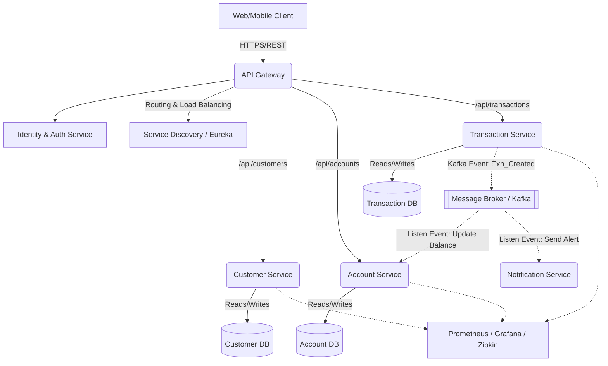

# Bank Management System: Detailed Microservices Architecture Design

## 1. Executive Summary
This document outlines the detailed microservices architecture design for the Bank Management System, migrating from the existing monolithic Spring Boot application. The design decomposes the system into isolated bounded contexts to achieve high availability, independent scalability, and fault tolerance.

---

## 2. Microservices Decomposition Strategy

We utilize Domain-Driven Design (DDD) to establish the following core domain services.

### 2.1. Customer Service
- **Responsibility:** Manages customer KYC (Know Your Customer) data, user profiles, and onboarding.
- **Database:** `CustomerDB` (PostgreSQL). We use a relational database to ensure strict schema enforcement for personal data.
- **Data Entities:** 
  - `Customer` (ID, Name, Email, Address, Phone, KYC_Status, CreatedAt).

### 2.2. Account Service
- **Responsibility:** Manages checking/savings accounts, tracks balances, and associates accounts to customers.
- **Database:** `AccountDB` (PostgreSQL). Ensures ACID properties necessary for financial ledger states.
- **Data Entities:** 
  - `Account` (AccountID, CustomerID, AccountType, Balance, Status, CreatedAt).

### 2.3. Transaction Service
- **Responsibility:** Manages the immutable ledger of deposits, withdrawals, and transfers.
- **Database:** `TransactionDB` (NoSQL - Cassandra / MongoDB). Selected to handle high-throughput append-only transaction logs.
- **Data Entities:** 
  - `Transaction` (TxID, FromAccountID, ToAccountID, Amount, Type, Timestamp, Status).

---

## 3. Infrastructure & Supporting Services

To support the distributed nature of the microservices, the following infrastructure layers will be implemented:

1. **API Gateway (Spring Cloud Gateway)**: Acts as the single entry point. Responsible for routing client requests (e.g., `/api/customers/` to `Customer Service`), SSL termination, and rate-limiting.
2. **Identity Provider / Auth Service (Keycloak)**: Generates and validates OAuth 2.0 / JWT tokens. The API Gateway will use this to authenticate requests before routing them.
3. **Service Discovery (Netflix Eureka)**: Enables microservices to discover each other dynamically. Services will register their IP/port with Eureka on startup.
4. **Configuration Server (Spring Cloud Config)**: Centralized repository for all environment variables and configuration files (`application.yml`) backed by a Git repository.
5. **Message Broker (Apache Kafka)**: Placed at the core of the event-driven architecture to facilitate asynchronous communication between services (e.g., SAGA pattern).
6. **Distributed Tracing (Zipkin & Sleuth)**: Attaches a unique `traceId` to every request traversing the Gateway to allow end-to-end debugging across microservices.

---

## 4. API Endpoints Contract

### Customer Service API
| Method | Endpoint | Description |
|---|---|---|
| `POST` | `/api/v1/customers` | Create a new customer profile. |
| `GET` | `/api/v1/customers/{id}` | Retrieve customer profile. |
| `PUT` | `/api/v1/customers/{id}` | Update customer details. |
| `DELETE` | `/api/v1/customers/{id}` | Deactivate a customer. |

### Account Service API
| Method | Endpoint | Description |
|---|---|---|
| `POST` | `/api/v1/accounts` | Open a new bank account for a given `customerId`. |
| `GET` | `/api/v1/accounts/{id}` | Get account balance and details. |
| `GET` | `/api/v1/accounts/customer/{customerId}` | List all accounts belonging to a customer. |

### Transaction Service API
| Method | Endpoint | Description |
|---|---|---|
| `POST` | `/api/v1/transactions/deposit` | Initiate a deposit to an account. |
| `POST` | `/api/v1/transactions/withdraw` | Initiate a withdrawal from an account. |
| `POST` | `/api/v1/transactions/transfer` | Move funds between two accounts. |
| `GET` | `/api/v1/transactions/account/{accountId}` | Get transaction history for an account. |

---

## 5. Event-Driven Communication & SAGA Pattern

Because databases are partitioned per service, we must avoid distributed locks (2PC) and rely on Eventual Consistency using the Choreography SAGA pattern.

### 5.1. Use Case: Fund Transfer
When a user transfers money from `Account A` to `Account B`:
1. **Transaction Service** receives the REST `POST /transfer` request. It persists a `PENDING` transaction in `TransactionDB` and emits a Kafka `TransferInitiatedEvent` to the broker.
2. **Account Service** consumes the event and attempts to deduct funds from `Account A`.
   - *Success:* It credits `Account B`, saves to `AccountDB`, and emits a `TransferSuccessEvent`.
   - *Failure (e.g., Insufficient Funds):* It rolls back the deduction and emits a `TransferFailedEvent`.
3. **Transaction Service** listens for the success or failure events and updates the `TransactionDB` record to `COMPLETED` or `FAILED`.

---

## 6. Architecture Diagrams

*(Note: A highly detailed node architecture visual was additionally provided as `Microservices_Architecture.drawio`)*

---

## 7. Migration Strategy (Strangler Fig Pattern)

To safely migrate the existing monolith to this architecture with zero downtime:
1. **Phase 1 (Proxy Configuration):** Deploy the **API Gateway** in front of the application. All traffic routes transparently to the monolith backend.
2. **Phase 2 (Extract Customer Context):** Build the new `Customer Service` and its database. Point `/api/v1/customers` traffic from the API Gateway to this new service. Migrate customer data from the monolith database to `CustomerDB`.
3. **Phase 3 (Extract Account Context):** Repeat the step for `Account Service`, linking customer IDs between the monolith and the new service over synchronous REST calls temporarily.
4. **Phase 4 (Legacy Decommission):** Extract `Transaction Service`. Once successfully shifted, dismantle the old monolithic codebase completely.

---

## 8. Security Considerations
- **Boundary Security:** The API Gateway acts as the strict entry point. Direct external access to `CustomerSvc` or `AccountSvc` is blocked by VPC routing.
- **Stateless Authentication:** Every microservice consumes stateless JWT tokens containing embedded permission scopes.
- **Data Protection:** Database volumes are encrypted via KMS at rest, and all transit between microservices utilizes mTLS (`HTTPS`).
